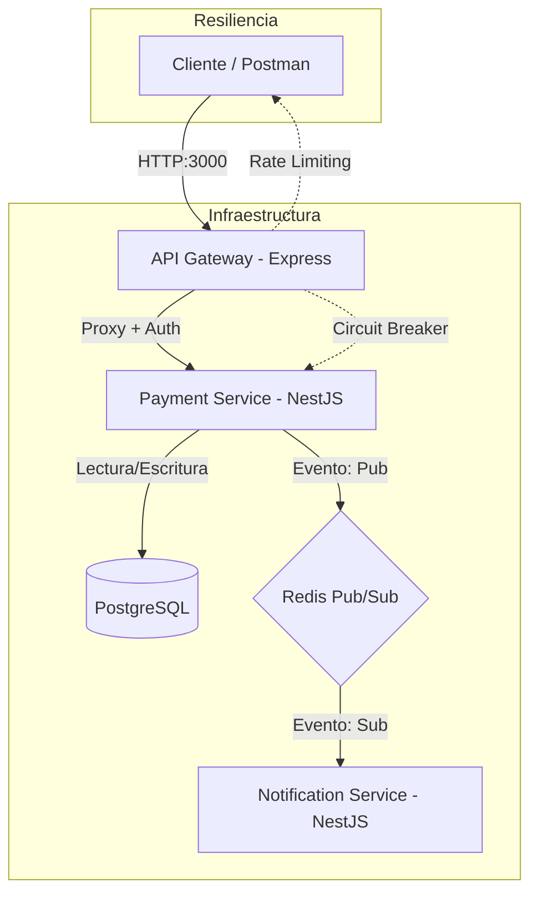

# Arquitectura del Sistema de Pagos

Este documento describe la arquitectura de microservicios diseñada para la gestión de pagos manuales.

## Diagrama de Arquitectura

## Componentes

### 1. API Gateway (Puerto 3000)
- **Tecnología:** Express.js.
- **Responsabilidades:**
    - Punto de entrada único.
    - **Autenticación Dual:** Soporta tanto API Keys (header `x-api-key`) como tokens JWT.
    - **Rate Limiting:** Protege contra ataques de denegación de servicio (100 req / 15 min).
    - **Circuit Breaker:** Implementado con `opossum`. Si el servicio de pagos falla repetidamente, el circuito se abre para evitar esperas infinitas.
    - **Proxy:** Redirige peticiones al servicio de pagos.

### 2. Payment Service (Puerto 3001)
- **Tecnología:** NestJS + Prisma ORM.
- **Responsabilidades:**
    - Core de la lógica de negocio.
    - Gestión de transacciones con máquina de estados (`pending`, `approved`, etc.).
    - Generación de referencias únicas.
    - Agrupación de transacciones en liquidaciones (*settlements*) mediante transacciones de BD atómicas.
    - **Health Checks:** Endpoint `/health` que verifica la conectividad real con la base de datos.
    - Emisión de eventos asíncronos vía Redis.

### 3. Notification Service (Puerto 3002)
- **Tecnología:** NestJS Microservices.
- **Responsabilidades:**
    - Escuchar eventos del bus de Redis.
    - Procesar notificaciones de forma asíncrona para no bloquear el flujo principal de pagos.

### 4. Base de Datos y Bus de Eventos
- **PostgreSQL:** Almacenamiento persistente de transacciones y merchants.
- **Redis:** Actúa como el motor de mensajería para la comunicación entre microservicios.

## Decisiones Técnicas y Trade-offs
1. **Redis Pub/Sub vs RabbitMQ:** Se eligió Redis por ser más ligero y fácil de configurar para una prueba técnica, cumpliendo perfectamente con el requisito de asincronía.
2. **Circuit Breaker en el Gateway:** Se decidió colocarlo aquí para que el sistema sea consciente de la salud del microservicio "aguas abajo" sin necesidad de intentar la conexión.
3. **Prisma ORM:** Seleccionado por su fuerte tipado y facilidad para manejar migraciones y esquemas complejos.
